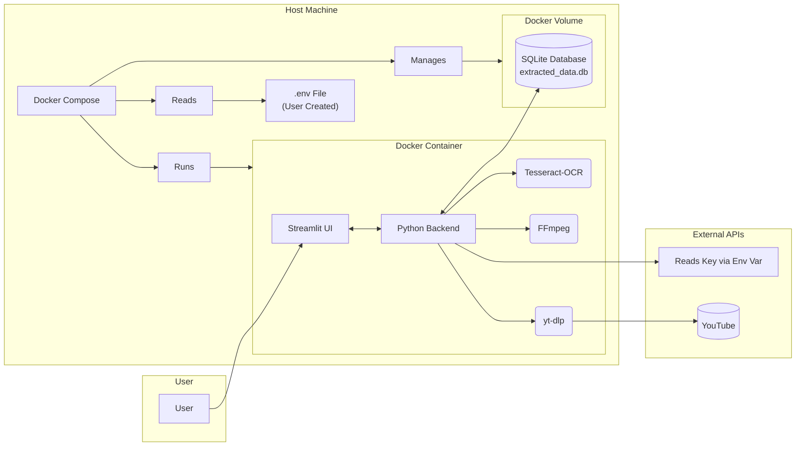
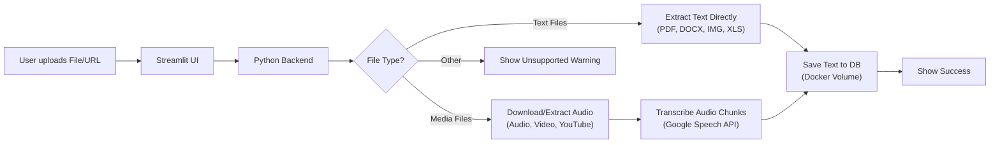
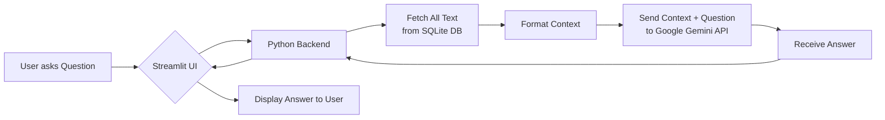

# 🧠 Multimodal Q&A Assistant

This is a multi-page Streamlit application that allows you to build a persistent, Docker-based knowledge base by uploading various media types or adding YouTube links. You can then ask questions about the ingested content using Google's Gemini AI.

## ✨ Features

* **Dockerized Deployment:** The entire application, including all system dependencies (FFmpeg, Tesseract), is containerized for easy and reliable deployment.
* **Persistent Storage:** Uses a **Docker Volume** to persist the SQLite database, meaning your data is safe even when you stop and restart the container.
* **Multi-Page Interface:** A clean, navigable UI with separate pages for uploading content, asking questions, and viewing your database.
* **Multimodal File Support:** Extract text and data from various file types (PDFs, DOCX, Images, Audio, Video, Excel).
* **YouTube Integration:** Automatically downloads and transcribes audio from any YouTube URL using `yt-dlp`.
* **AI-Powered Q&A:** Uses **Google's Gemini** model to answer questions based *only* on the context provided.
* **Robust Audio Transcription:** Handles long audio files by intelligently chunking the audio.
* **Data Management:** A page to view, preview, and delete entries from the knowledge base.

---

## 📊 System Architecture and Data Flow

### System Architecture

The application runs as a single Docker container managed by Docker Compose. A Docker Volume ensures the SQLite database persists. The Gemini API key is read from a local `.env` file via Docker Compose.


## Data Flow
**Ingestion Flow:**


**Q&A:** 

## 💻 Tech Stack
**Containerization:** Docker & Docker Compose

**Frontend:** Streamlit

**Backend:** Python

**AI Model:** Google Gemini (gemini-1.5-flash)

**Database:** SQLite 3

**Audio/Video Processing:** yt-dlp, moviepy, pydub

**Text Extraction (OCR):** pytesseract

**Audio Transcription:** SpeechRecognition (Google Web Speech API)

**File Handling:** PyPDF2, python-docx, pandas, Pillow

## 🚀 How to Deploy Locally (with Docker)
This project uses Docker to package the application and all its system dependencies (like FFmpeg and Tesseract). This ensures it runs reliably on your machine.

**1. Clone the Repository**
```bash
git clone [https://github.com/your-username/multimodal-project.git](https://github.com/your-username/multimodal-project.git)
cd multimodal-project
```

**2. Create Your API Key File (.env)**

This project requires a ```Google Gemini API key```. You need to create a file named ```.env``` in the root directory of the cloned project. Add your API key to this file like so:

```
# .env
GEMINI_API_KEY=AIzaSy...your_actual_key_here
```

(Note: This .env file is listed in .gitignore and should NOT be committed to version control.)

**3. Ensure Project Files Are Present**

Your cloned repository should contain the necessary configuration files: ```requirements.txt```, ```Dockerfile```, and ```docker-compose.yml```.

**4. Run the App with Docker Compose**

Make sure you have ```Docker Desktop``` installed and running on your system.
  
 **A)  Build and Start the App :**
 Run this command in your terminal from the project's root directory. Docker Compose will automatically read your .env file.

 ```code
 docker-compose up -d --build
 ```
 (The first time takes longer as it builds the Docker image)

 **B) Access Your App:**   Open your web browser and go to: http://localhost:8501

 **C) Stop the App :** To stop the running container:
 ```code 
 docker-compose down
 ```
 (Your data in extracted_data.db is safe because it's stored in the db_data Docker volume)

**D) Start the App Again (Later):**  To start the app without rebuilding:
```code
docker-compose up -d
```

## 📖 Usage
Navigate using the sidebar:

*   **Welcome Page (app.py):** Landing page.

* **1. Upload Data:** Add content via YouTube URL or file upload. Click "Process" to save it to the knowledge base.

* **2. Ask Questions:** View available files in the sidebar. Ask questions about the content; the AI will answer based only on the stored data.

* **3. View Data:** Browse, preview, and delete entries stored in the knowledge base.